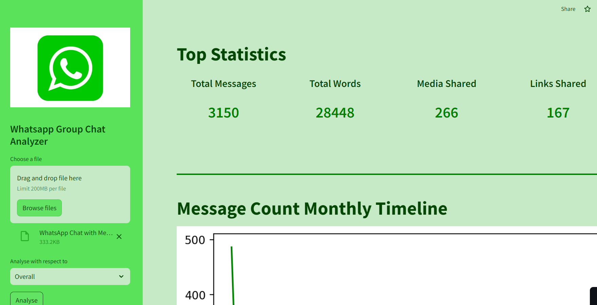
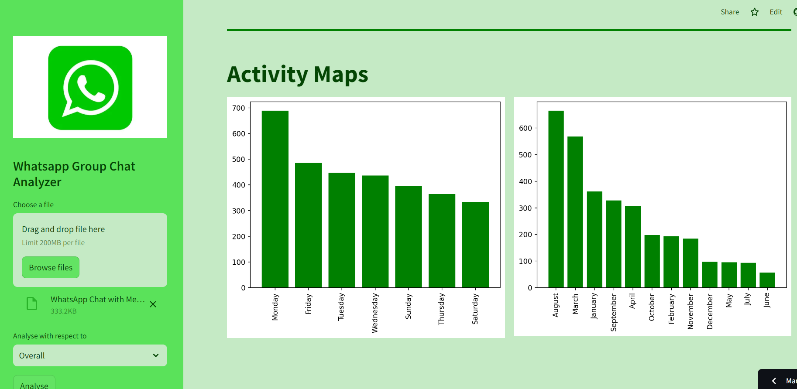
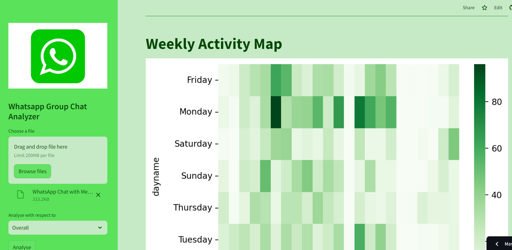
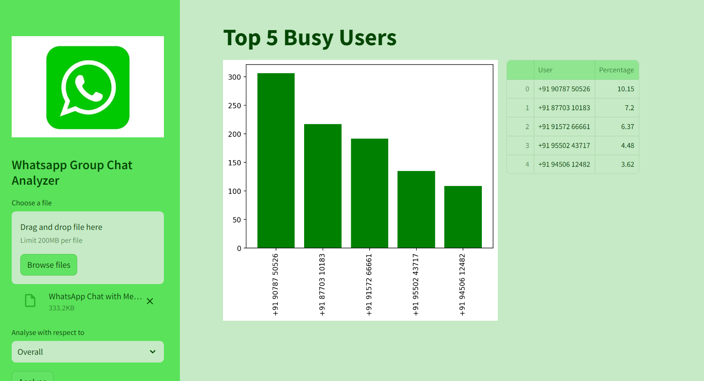
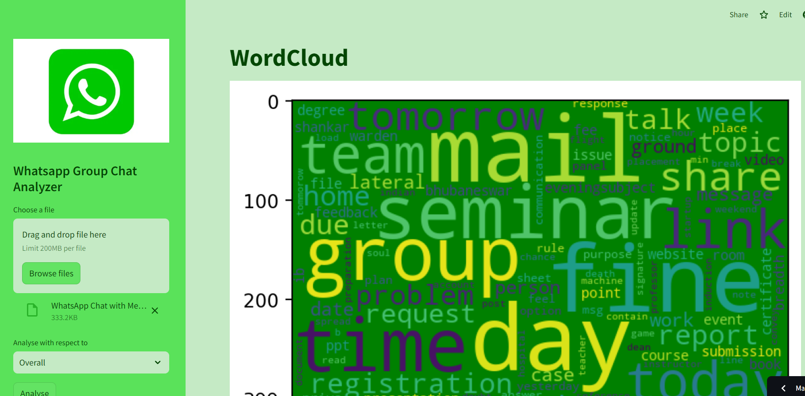
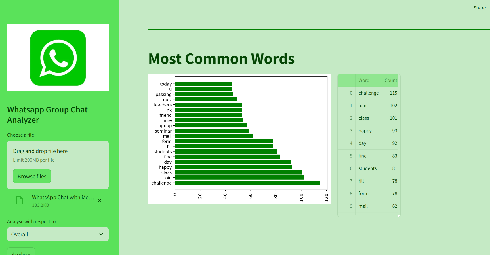
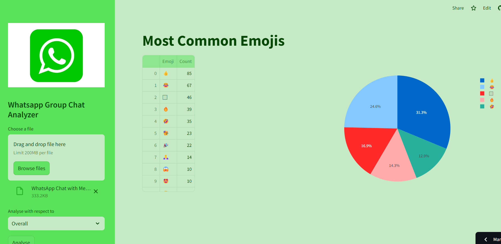

# Whatsapp-Chat-Analysis-Project

i.) It analyzes User uploaded Whatsapp chats and provides interesting figures such as activity heat maps, wordcloud , top users, most frequent words and more.

ii.) It works on both group and personal chats.

iii.) Streamlit is used to make the website.

## These are the different images of the app:








## To get started with this project,follow the steps mentioned below:
1. Clone the repository
```bash
git clone https://github.com/rishabhpancholi/Whatsapp-Group-Chat-Analysis-Project.git
cd Whatsapp-Group-Chat-Analysis-Project
```

2.Install dependencies
Install the following python packages using the following script-

```bash
pip install -r requirements.txt
```

3.Run the application through this command-

```bash
python app.py
```

